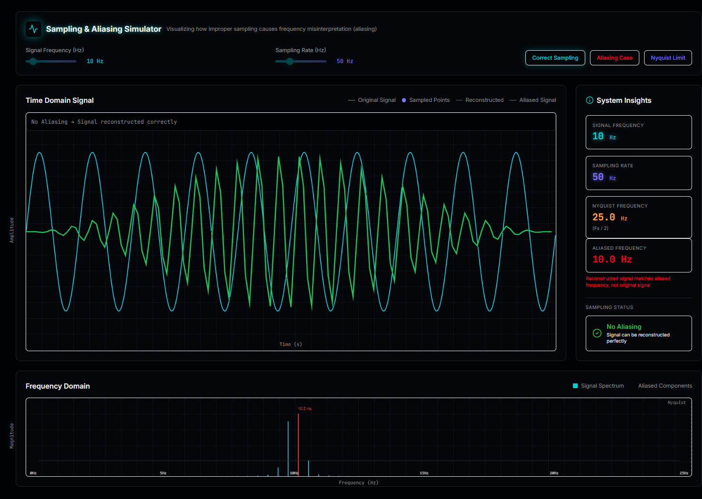
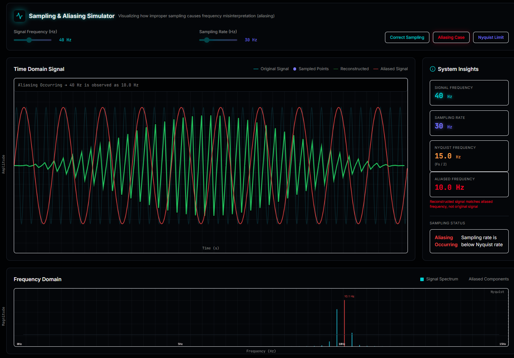
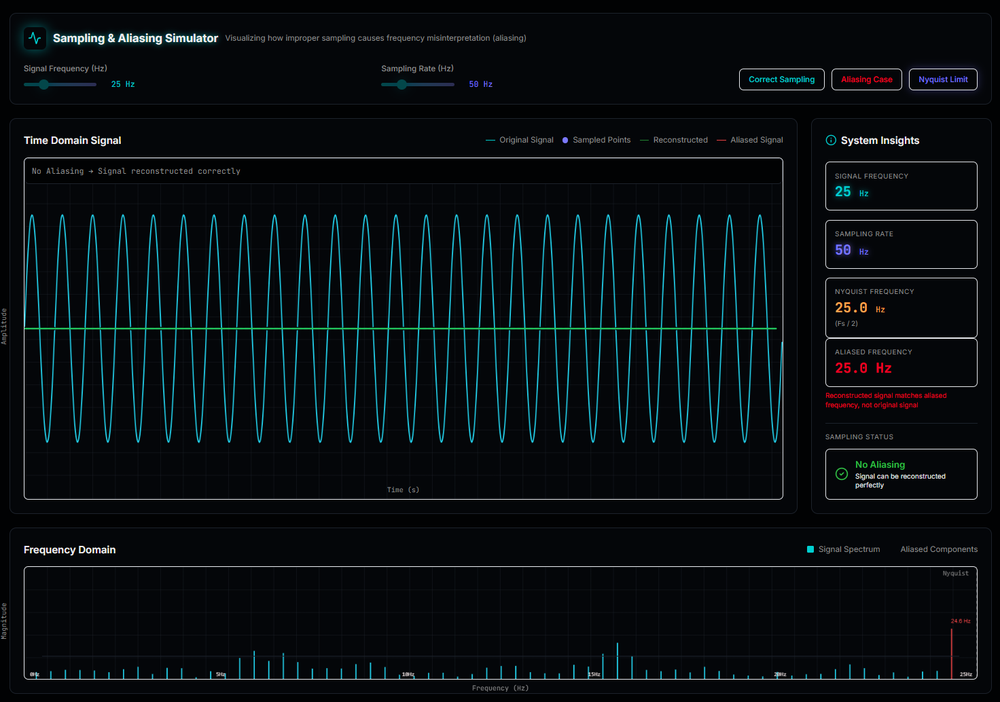

# Sampling & Aliasing Simulator

An interactive visual simulator that demonstrates how improper sampling leads to **aliasing**, a fundamental concept in signal processing.

---

## Live Demo

--> (https://aliasing-simulator.vercel.app/)

---

## Overview

Sampling is the process of converting a continuous-time signal into discrete samples.
If the sampling rate is too low, the signal gets **misinterpreted**, leading to **aliasing**.

This simulator provides an intuitive, real-time visualization of:

* Time-domain signal behavior
* Sampling and reconstruction
* Aliasing effects
* Frequency-domain (FFT) analysis

---

## Key Concepts Demonstrated

* **Nyquist Theorem**
  A signal must be sampled at least **2× its frequency** to avoid aliasing.

* **Aliasing**
  When sampled below Nyquist rate, high-frequency signals appear as lower frequencies.

* **Frequency Folding**
  Signals “fold” into the observable range ([0, Fs/2]).

---

## Features

* 🎛️ Interactive sliders for:

  * Signal Frequency
  * Sampling Rate

* 📈 Time Domain Visualization:

  * Original Signal
  * Sampled Points
  * Reconstructed Signal
  * Aliased Signal

* 📊 Frequency Domain (FFT):

  * Spectrum visualization
  * Peak frequency detection
  * Nyquist limit indicator

* 🧾 Smart Explanation System:

  * Real-time explanation of what is happening
  * Automatically detects aliasing / critical sampling

* ⚡ Preset Scenarios:

  * No Aliasing
  * Aliasing Example
  * Critical Sampling

---

## How It Works

### 1. Signal Generation

A sine wave is generated based on the selected frequency.

### 2. Sampling

The signal is sampled at discrete intervals defined by the sampling rate.

### 3. Reconstruction

The sampled signal is interpolated to approximate the original.

### 4. Aliasing Detection

If:

```
Fs < 2 × Fsignal
```

aliasing occurs and the observed frequency changes.

### 5. Frequency Analysis

A Discrete Fourier Transform (DFT) is used to compute the signal spectrum.

---

## Example

| Signal | Sampling | Observed |
| ------ | -------- | -------- |
| 40 Hz  | 30 Hz    | 10 Hz    |
| 50 Hz  | 30 Hz    | 10 Hz    |
| 65 Hz  | 30 Hz    | 5 Hz     |

---

## Tech Stack

* **HTML5 Canvas** — Visualization
* **JavaScript (Vanilla)** — Logic & simulation
* **Tailwind CSS** — UI styling

---

## Installation & Setup

```bash
git clone https://github.com/nishchay28/Aliasing-Simulator.git
```

Open `index.html` in browser.

---

## Use Cases

* Learning Digital Signal Processing (DSP)
* Understanding Nyquist & aliasing visually
* Educational demonstrations
* Hackathon projects

---

## SnapShots

### NO Aliasing


### Aliasing Example


### Critical Sampling


---

## Future Improvements

* Real FFT optimization
* Audio signal input
* Interactive waveform drawing
* Export graphs

---

## Author

Built as part of a hackathon project to demonstrate core signal processing concepts in an intuitive way.